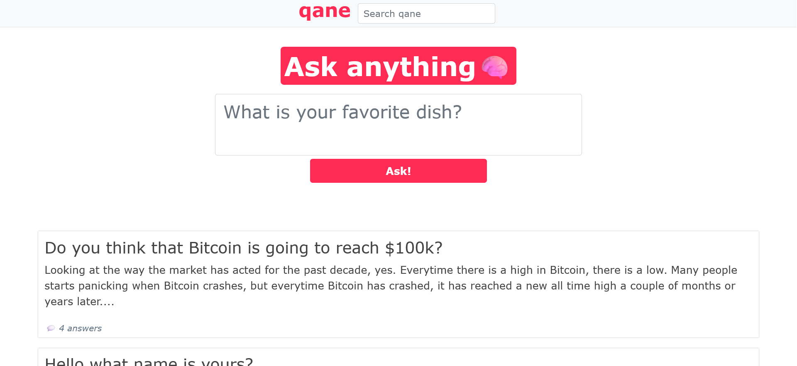
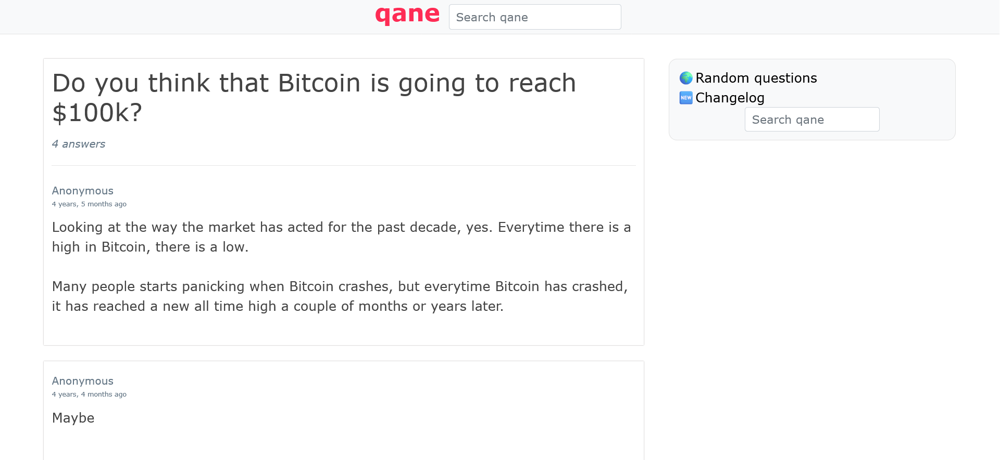

# About qane.net (2020–2023)

qane.net was a question-and-answer website that allowed anyone to ask and answer questions without requiring registration.

It served as an anonymous, privacy-oriented alternative to Quora, created after I grew tired of being prompted to sign up just to view multiple questions.

Features:
- Infinite scrolling
- Ask & questions
- A random page that shows a random question asked on qane, for each refresh
- Admin panel
- Captcha (The one used is bad, Cloudflare Turnstile or ReCAPTACHA are better options)
- Search function
- Changelog

How to run in terminal:

1. git clone https://github.com/maybexp/qane.git
2. cd qane
3. pip install -r requirements.txt
4. python manage.py runserver

Admin panel link and credentials:
localhost:8000/admin-fun

- username: admin
- password: Random1234

The current data is loaded via an SQLite file. When qane.net was running, I used PostgreSQL.

